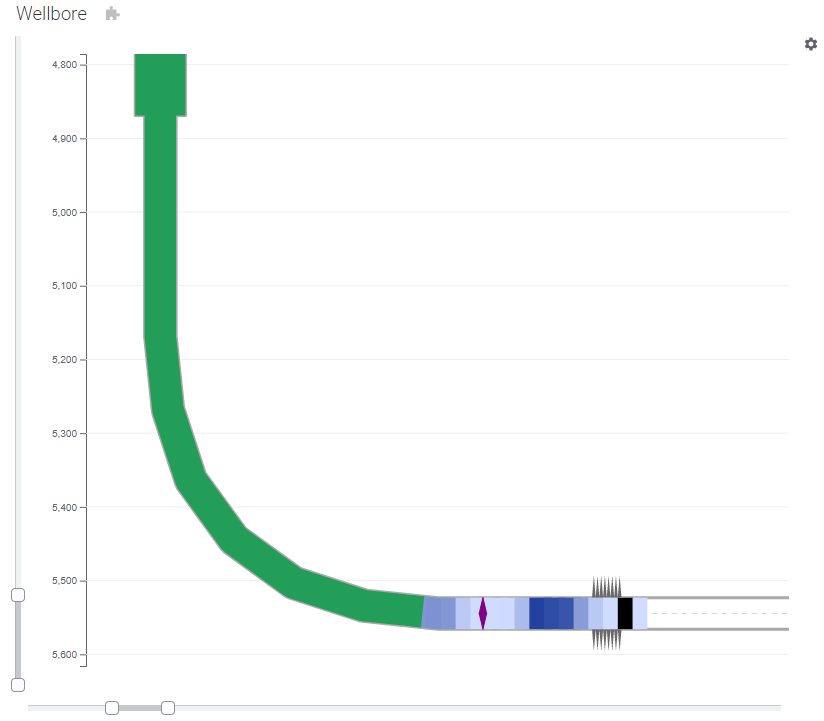
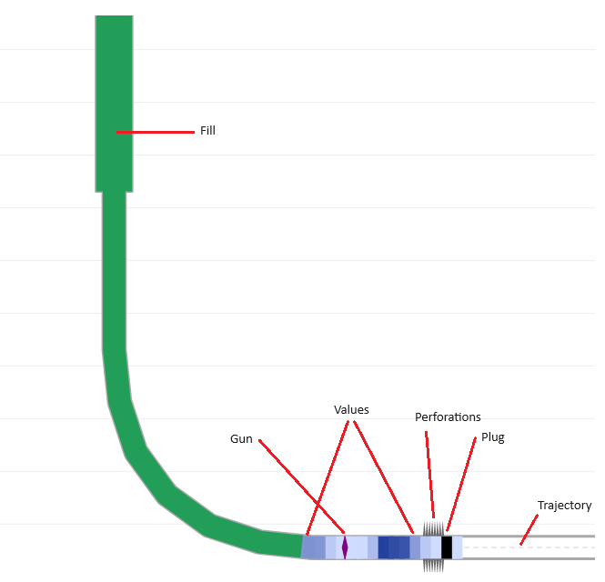
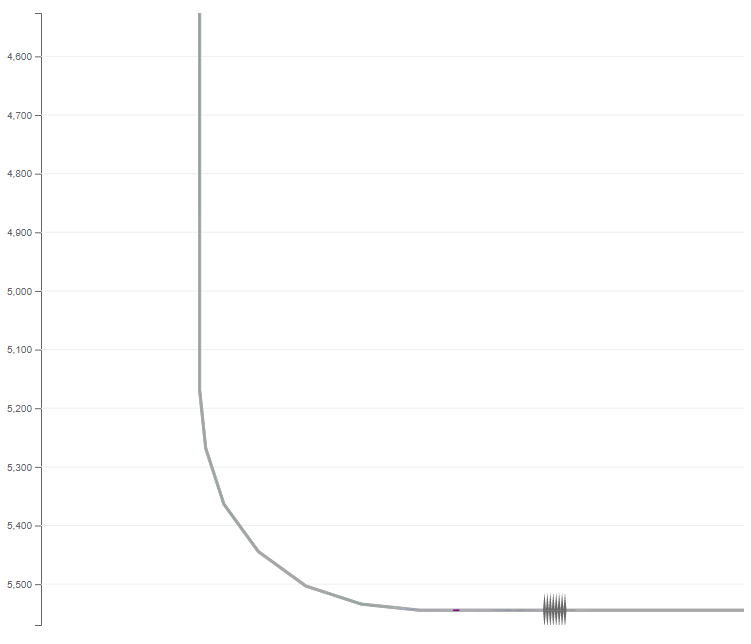
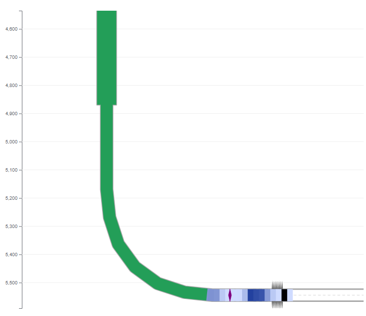
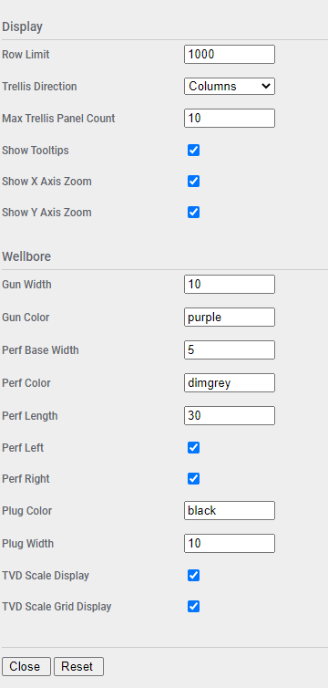

# Wellbore Mod for Spotfire®

The Wellbore Mod is a schematic representation of a wellbore in 2 dimensions, plotting True Vertical Depth (TVD) versus Measured Depth (MD). It can be used to visualize fluid penetration into a wellbore during completion activities, relative positions of plugs and perforations, and plot colored values at various measured depths.


## Try this mod in Spotfire® Analyst

### How to open the mod
1. Open Spotfire® Analyst, and create an analysis by loading some data.
1. Unzip the downloaded file, and locate the .mod file in the unzipped folder. 
1. Drag the file into the analysis. 
1. The visualization mod is added to the analysis.
1. To learn about the capabilities and limitations of this visualization mod, keep reading.

For general information on how to use and share visualization mods, [read the Spotfire documentation](https://docs.tibco.com/pub/sfire-analyst/latest/doc/html/en-US/TIB_sfire-analyst_UsersGuide/index.htm#t=modvis%2Fmodvis_how_to_use_a_visualization_mod.htm).

## Data requirements

Every mod handles missing, corrupted and/or inconsistent data in different ways. It is advised to always review how the data is visualized.

The Wellbore Mod will draw a a 2D representation of a wellbore, with associated metrics. This is generally derived from survey data. If the data is plotted using measured depth, azimuth, and inclination, then the data will need to be prepared to map the trajectory as a series of rows including TVD and MD. Refer to the sample for details of what this looks like.

* **True Vertical Depth (TVD)** - vertical distance from a surface reference point to the point being plotted.

* **Measured Distance (MD)** - linear distance along the wellbore to the point being plotted.

For perfectly vertical wells, TVD and MD are the same at any given point. For deviated or horizontal wells, the MD will start out the same as TVD, but will increase as the well deviates from vertical. 

These two values represent co-ordinates for plotting the wellbore form in the visualization. Additional data can be plotted along the wellbore:

* **Guns** - tools used to create perforations.

* **Fills** - a value which will apply from the top of the wellbore to a specific measured depth with a specified value. Generally you will have only one of these for a wellbore.

* **Perforations** - holes punched through the casing material into the formation to facilitate fluid transfer into the wellbore.

* **Plugs** - tools that are used to isolate part of a wellbore for completion activities.

* **Values** - a value at a specified measured depth which will display a value at that depth, +/- half way to the next depth value provided. Generally you will have a series of these for a wellbore.

## Setting up the Wellbore Mod

The Mod includes the following axes. Not all axis values are mandatory and this will be indicated.

### Trellis By

Optional. The Mod supports trellising with rows being grouped by the value in this axis. 

### Group By 

Optional. Groups rows together to render as a single wellbore.

### Layer Type 

Mandatory. Must contain one of the following permitted values depending on row context.

* **Trajectory** - identifies trajectory rows, drawn as a centerline and left and right borehole lines. Mandatory.

* **Value** - identifies value rows, drawn as small fills in the wellbore at the MD, +/- half way to the next MD Value row. Optional, multiple rows per visualization.

* **Fill** - identifies fill rows, drawn as complete fill from zero measured depth to the specified measured depth. Optional, generally a single row per visualization.

* **Perforation** - identifies perforation rows, drawn as triangles on the left and right borehole lines indication perforation locations. Optional, multiple rows per visualization.

* **Gun** - identifies gun rows, drawn as a diamond across the diameter of the wellbore. Optional, multiple rows per visualization.

* **Plug** - identifies plug rows, drawn as a single box across the width of the wellbore at the specified measured depth. Optional, multiple rows per visualization.

Any other value will cause the row to be ignored.

These different row types and how they are rendered are shown in this diagram:



### MD 

Mandatory for Trajectory, Value, Fill, Gun, and Plug row types (all except Perforation). Measured depth. Must be in units consistent with Diameter and TVD.

### TVD 

Mandatory for Trajectory row types. Ignored for other row types. True vertical depth. Must be in units consistent with Diameter and TVD.

### Diameter 

Mandatory for Trajectory row types. Ignored for other row types. Wellbore diameter. Must be in units consistent with Diameter and TVD. At scale this will usually render as a single line, so it will be necessary to use an exaggeration factor to expand the diameter into something that allows the wellbore to be filled for data rendering purposes. The sample illustrates one way to do this using an expression on the axis that uses a Document Property and a slider in a Text Area to make it user settable.

The expression looks like this, assuming TVD and MD are in feet, and the column _diameter_in_ is in inches: 

```
[diameter_in] / 12 * DocumentProperty("DiameterExaggeration")
```

A diameter without exaggeration would look like this:



And with an exaggeration factor of 200:



### Value 

Mandatory for Value row types, optional for Fil row types. Ignored for other row types. Value at the specified MD for Value row types and the value up to the specified MD for Fill row types. Does not render on the visualization directly, but will be visible in the tooltip.

### Perf Start MD

Mandatory for Perforation row types. Ignored for other row types. Starting measured depth for perforation interval.

### Perf End MD

Mandatory for Perforation row types. Ignored for other row types. Ending measured depth for perforation interval.

### Color 

Optional. Sets the color of the Fill or Value row. This axis supports both continuous and categorical expressions.

## Configuring the Wellbore

Additional configuration for the mod can be accessed by clicking on the small settings icon in the upper right corner of the visualization area. This will display the configuration properties over the visualization. Maximize the visualization if necessary to update the fields. The configuration panel will only be accessible when the analysis is in Editing mode. 



| Property | Description | Remarks |
| -------- | ----------- | ------- |
| Row Limit | Maximum number of rows to render | If the row count is exceeded then an error message will be displayed. This is a safety feature to keep from accidentally rendering too much data. |
| Trellis Direction | Direction for trellis panels | Columns or Rows |
| Max Trellis Panel Count | Maximum number of trellis panels to render | If the panel count is exceeded then an error message will be displayed. This is a safety feature to keep from accidentally rendering too much data. |
| Show Tooltips | Display tooltips | |
| Show X Axis Zoom | Display X-axis zoom slider | |
| Show Y Axis Zoom | Display Y-axis zoom slider | |
| Gun Width | Gun width in pixels | |
| Gun Color | Gun color | May be any valid HTML color name or hex color code |
| Perf Base Width | Perforation base width in pixels | Depending on wellbore scaling it might be necessary to adjust this setting and perf length to get a reasonable render |
| Perf Color | Perforation color | May be any valid HTML color name or hex color code |
| Perf Length | Perforation length in pixels | |
| Perf Left | Show perforations on borehole left  | For horizontal wells, this will be the bottom |
| Perf Right | Show perforations on borehole right  | For horizontal wells, this will be the top |
| Plug Width | Plug width in pixels | Depending on wellbore scaling it might be necessary to adjust this setting to get a reasonable render |
| TVD Scale Display | Show TVD scale |  |
| TVD Scale Grid Display | Show TVD scale grid |  |

## Using the Wellbore

Once the mod is configured it will render a schematic representation of a wellbore, associated fills and values, guns, perforations, and plugs. All data rows are keyed on MD and fills and values will be computed to follow the wellbore size and geometry.

### Marking

The mod supports marking of value and fill rows if configured. Click a value or fill to mark it. Use CTRL-Click to add additional rows to the marking, or remove an already marked row. To clear the marking, click in any open area.

## Building the Project

In a terminal window:
- `npm install`
- `npm start`

In a new terminal window:
- `npm run server`

## More information about Spotfire® Mods

- [Spotfire® Visualization Mods on the Spotfire® Community Exchange](https://community.spotfire.com/files/category/7-visualization-mods/): A safe and trusted place to discover ready-to-use Mods
- [Spotfire® Mods Developer Documentation](https://spotfiresoftware.github.io/spotfire-mods/docs/): Introduction and tutorials for Mods Developers
- [Mods by Spotfire®](https://github.com/spotfiresoftware/spotfire-mods/releases/latest): A public repository for example projects


© Copyright 2024. Cloud Software Group, Inc.


